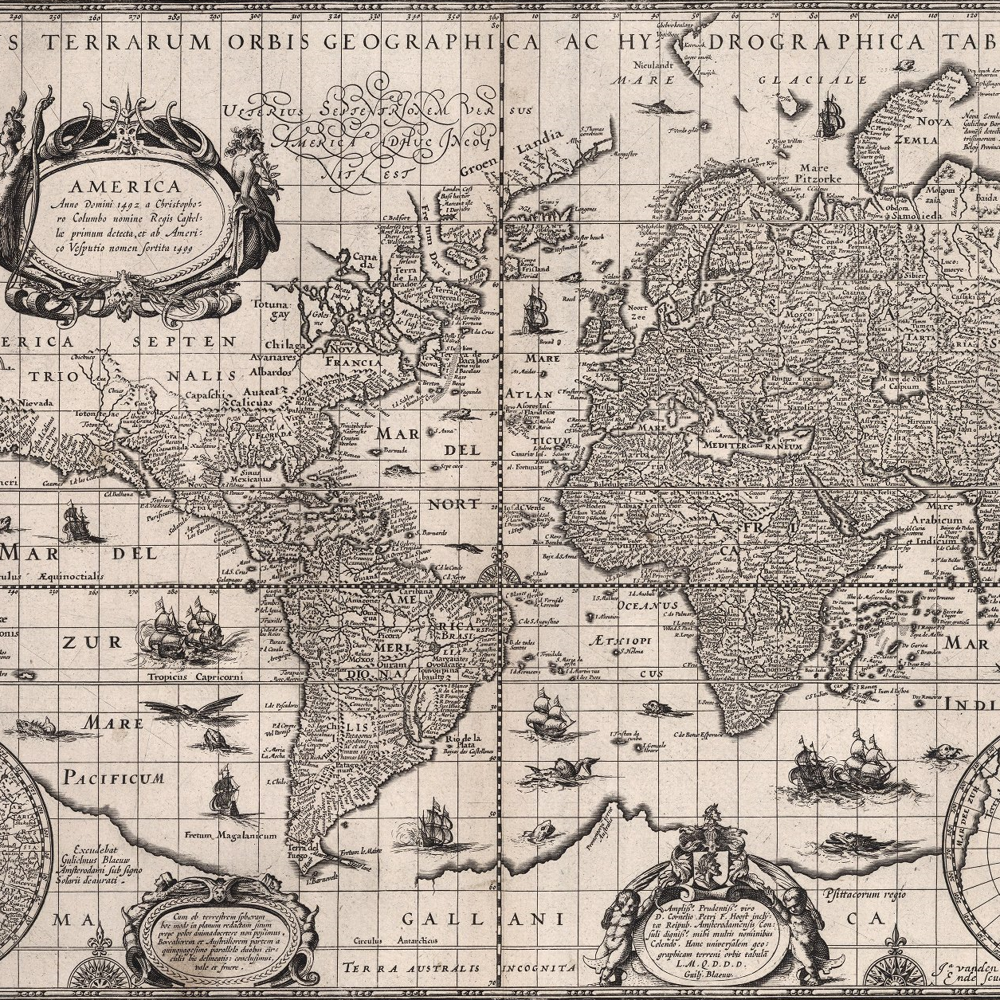

```{=html}
<section class="page-banner teaching-banner" aria-labelledby="teaching-title">
  <div class="page-shell">
    <h1 id="teaching-title">Teaching</h1>
    <p class="teaching-recognition"><strong>Teacher of the Year, 2020.</strong> Lund University School of Economics and Management.</p>
  </div>
</section>
<div class="page-shell">
  <section class="teaching-content" aria-labelledby="courses-title">
    <h2 id="courses-title">Current teaching</h2>
    <div class="course-grid">
      <article class="course-card">
        <a class="course-link" href="https://kursplaner.lu.se/pdf/kurs/sv/EOSE02">
          
          <h3>Colonialism and Economic Change</h3>
          <span class="syllabus-link">Syllabus (Swedish) <span aria-hidden="true">↗</span></span>
        </a>
        <p>Since 2019 · EOSE02<br>Lecturer</p>
      </article>


      <article class="course-card">
        <a class="course-link" href="https://kursplaner.lu.se/pdf/kurs/en/UTVC21">
          
          <h3>Development in a Historical Perspective</h3>
          <span class="syllabus-link">Course syllabus <span aria-hidden="true">↗</span></span>
        </a>
        <p>Since 2025 · UTVC21<br>Course convener</p>
      </article>


    </div>
    <section class="teaching-history" aria-labelledby="earlier-teaching-title">
      <h2 id="earlier-teaching-title">Earlier teaching</h2>
      <p class="section-caption">Lund University</p>
      <article class="teaching-entry">
        <p class="teaching-years">2023–2026</p>
        <div><h3>Growth, Stagnation, and Inequality in Africa</h3><p>Bachelor’s · EKHB21 · Lecturer &amp; course convener</p></div>
      </article>
      <article class="teaching-entry">
        <p class="teaching-years">2019–2026</p>
        <div><h3>The Art of Writing and Reporting</h3><p>Bachelor’s · EOSE08 · Lecturer &amp; course convener</p></div>
      </article>
      <article class="teaching-entry">
        <p class="teaching-years">2019–2026</p>
        <div><h3>Field Work, Internship and Research Overview</h3><p>Bachelor’s · EKHK17 · Lecturer &amp; course convener</p></div>
      </article>
      <article class="teaching-entry">
        <p class="teaching-years">2019–2024</p>
        <div><h3>Development of Emerging Economies</h3><p>Master’s · EKHM61 · Lecturer</p></div>
      </article>
      <article class="teaching-entry">
        <p class="teaching-years">2024</p>
        <div><h3>Development Theories</h3><p>Bachelor’s · UTVC23 · Lecturer</p></div>
      </article>
      <article class="teaching-entry">
        <p class="teaching-years">2022–2023</p>
        <div><h3>Institutions, Economic Growth and Equity</h3><p>Master’s · EKHM84 · Lecturer</p></div>
      </article>
      <article class="teaching-entry">
        <p class="teaching-years">2020</p>
        <div><h3>Statistics and Data</h3><p>Bachelor’s · EOSE06 · Lecturer</p></div>
      </article>
      <article class="teaching-entry">
        <p class="teaching-years">2019–2020</p>
        <div><h3>Research Methods in Development Studies</h3><p>Bachelor’s · UTVC26 · Lecturer &amp; course convener</p></div>
      </article>
    </section>
    <section class="supervision-section" id="supervision" aria-labelledby="supervision-title">
      <h2 id="supervision-title">Supervision &amp; examination</h2>
      <div class="supervision-grid">
        <article><h3>Bachelor’s</h3><p>Thesis supervision and examination in economic history, including research design, empirical methods, written feedback, and oral defence.</p></article>
        <article><h3>Master’s</h3><p>Thesis supervision and examination in economic history, with a focus on empirical design, dataset construction, and the development of an argument.</p></article>
        <article><h3>Doctoral</h3><p>Co-supervision in economic history, contributing to research design, empirical strategy, writing, and career development.</p></article>
      </div>
    </section>
    <div class="teaching-contact"><p>For course descriptions, supervision enquiries, or letters of recommendation, please get in touch.</p><div class="text-links"><a href="mailto:igor.martins@ekh.lu.se">igor.martins@ekh.lu.se <span aria-hidden="true">↗</span></a></div></div>
  </section>
</div>
```
