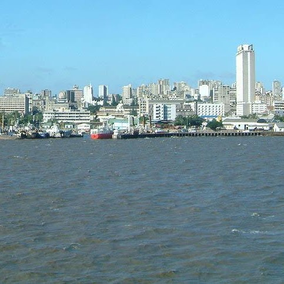

```{=html}
<section class="page-banner teaching-banner" aria-labelledby="teaching-title">
  <div class="page-shell">
    <h1 id="teaching-title">Teaching</h1>
    <p class="lead">I teach economic history, emerging economies, and the history of colonialism, alongside academic writing and research methods.</p>
    <p class="teaching-recognition"><strong>Teacher of the Year, 2020.</strong><br>Lund University School of Economics and Management.</p>
  </div>
</section>
<div class="page-shell">
  <section class="teaching-content" aria-labelledby="courses-title">
    <h2 id="courses-title">Courses &amp; supervision</h2>
    <div class="course-grid">
      <article class="course-card">
        <a class="course-link" href="https://kursplaner.lu.se/pdf/kurs/en/EOSE02">
          
          <h3>Colonialism and Economic Change</h3>
          <span class="syllabus-link">Course syllabus <span aria-hidden="true">↗</span></span>
        </a>
        <p>Autumn 2026 <span aria-hidden="true">·</span> EOSE02</p>
      </article>
      <article class="course-card">
        <a class="course-link" href="https://kursplaner.lu.se/pdf/kurs/en/EKHB21">
          
          <h3>Growth, Stagnation, and Inequality in Africa</h3>
          <span class="syllabus-link">Course syllabus <span aria-hidden="true">↗</span></span>
        </a>
        <p>Autumn 2026 <span aria-hidden="true">·</span> EKHB21</p>
      </article>
      <article class="course-card">
        <a class="course-link" href="https://kursplaner.lu.se/pdf/kurs/en/EKHM61">
          
          <h3>Development of Emerging Economies</h3>
          <span class="syllabus-link">Course syllabus <span aria-hidden="true">↗</span></span>
        </a>
        <p>Autumn 2026 <span aria-hidden="true">·</span> EKHM61</p>
      </article>
      <article class="course-card">
        <a class="course-link" href="https://kursplaner.lu.se/pdf/kurs/en/UTVC23">
          
          <h3>Development in a Historical Perspective</h3>
          <span class="syllabus-link">Course syllabus <span aria-hidden="true">↗</span></span>
        </a>
        <p>Autumn 2026 <span aria-hidden="true">·</span> UTVC23</p>
      </article>
      <article class="course-card">
        <a class="course-link" href="https://kursplaner.lu.se/pdf/kurs/en/EKHK17">
          
          <h3>Field Work, Internship and Research Overview</h3>
          <span class="syllabus-link">Course syllabus <span aria-hidden="true">↗</span></span>
        </a>
        <p>Spring 2026 <span aria-hidden="true">·</span> EKHK17</p>
      </article>
      <article class="course-card">
        
        <h3>BSc and MSc thesis supervision</h3>
        <a class="syllabus-link" href="mailto:igor.martins@ekh.lu.se">Discuss supervision <span aria-hidden="true">↗</span></a>
        <p>Throughout the year</p>
      </article>
    </div>
    <div class="teaching-contact"><p>For course descriptions, supervision enquiries, or letters of recommendation, please get in touch.</p><div class="text-links"><a href="mailto:igor.martins@ekh.lu.se">igor.martins@ekh.lu.se <span aria-hidden="true">↗</span></a></div></div>
  </section>
</div>
```
