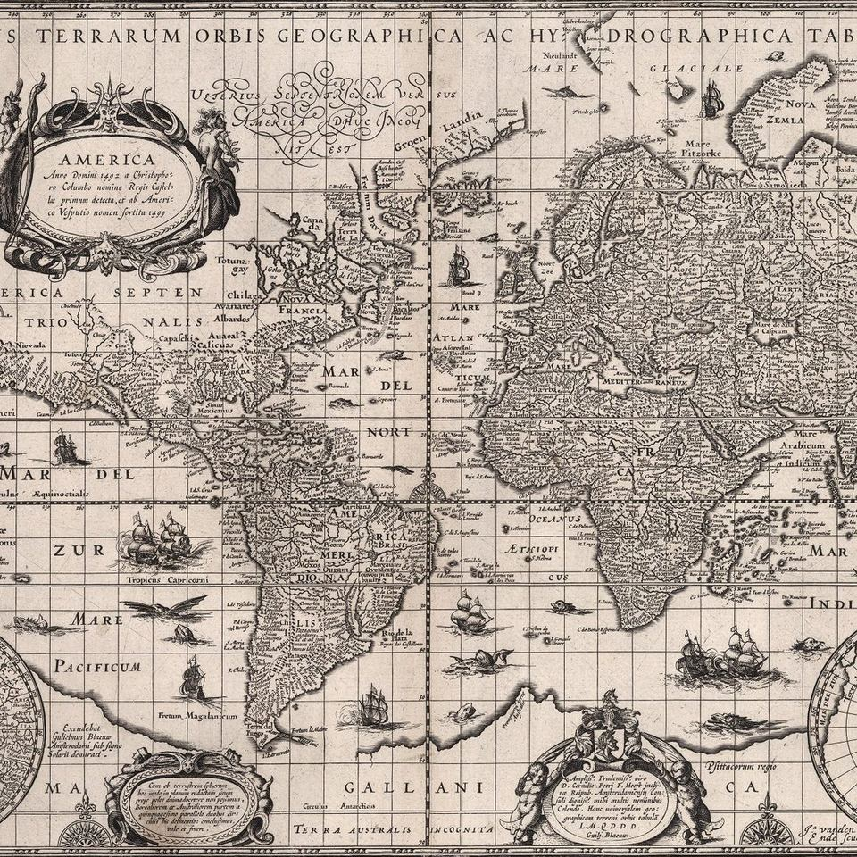

```{=html}
<section class="page-banner teaching-banner" aria-labelledby="teaching-title">
  <div class="page-shell">
    <h1 id="teaching-title" data-i18n="teach.title">Teaching</h1>
    <p class="teaching-recognition" data-i18n-html="teach.recog"><strong>Teacher of the Year, 2020.</strong> Lund University School of Economics and Management.</p>
  </div>
</section>
<div class="page-shell">
  <section class="teaching-content" aria-labelledby="courses-title">
    <h2 id="courses-title" data-i18n="teach.current">Current teaching</h2>
    <div class="course-grid">
      <article class="course-card">
        <a class="course-link" href="https://kursplaner.lu.se/pdf/kurs/en/UTVC21">
          
          <h3>Development in a Historical Perspective</h3>
          <span class="syllabus-link"><span data-i18n="teach.syllabus">Course syllabus</span> <span aria-hidden="true">↗</span></span>
        </a>
        <p><span data-i18n="teach.since">Since</span> 2025 · UTVC21<br><span data-i18n="course.convener">Course convener</span></p>
      </article>


      <article class="course-card">
        <a class="course-link" href="https://kursplaner.lu.se/pdf/kurs/sv/EOSE02">
          
          <h3>Colonialism and Economic Change</h3>
          <span class="syllabus-link"><span data-i18n="teach.syllabus.sv2">Syllabus (Swedish)</span> <span aria-hidden="true">↗</span></span>
        </a>
        <p><span data-i18n="teach.since">Since</span> 2019 · EOSE02<br><span data-i18n="course.lecturer">Lecturer</span></p>
      </article>


    </div>
    <section class="teaching-history" aria-labelledby="earlier-teaching-title">
      <h2 id="earlier-teaching-title" data-i18n="teach.earlier">Earlier teaching</h2>
      <p class="section-caption" data-i18n="inst.lu">Lund University</p>
      <article class="teaching-entry">
        <p class="teaching-years">2024</p>
        <div><h3>Development Theories</h3><p><span data-i18n="level.ba">Bachelor’s</span> · UTVC23 · <span data-i18n="course.lecturer">Lecturer</span></p></div>
      </article>
      <article class="teaching-entry">
        <p class="teaching-years">2023–2026</p>
        <div><h3>Growth, Stagnation, and Inequality in Africa</h3><p><span data-i18n="level.ba">Bachelor’s</span> · EKHB21 · <span data-i18n="teach.both">Lecturer &amp; course convener</span></p></div>
      </article>
      <article class="teaching-entry">
        <p class="teaching-years">2022–2023</p>
        <div><h3>Institutions, Economic Growth and Equity</h3><p><span data-i18n="level.ma">Master’s</span> · EKHM84 · <span data-i18n="course.lecturer">Lecturer</span></p></div>
      </article>
      <article class="teaching-entry">
        <p class="teaching-years">2020</p>
        <div><h3>Statistics and Data</h3><p><span data-i18n="level.ba">Bachelor’s</span> · EOSE06 · <span data-i18n="course.lecturer">Lecturer</span></p></div>
      </article>
      <article class="teaching-entry">
        <p class="teaching-years">2019–2026</p>
        <div><h3>The Art of Writing and Reporting</h3><p><span data-i18n="level.ba">Bachelor’s</span> · EOSE08 · <span data-i18n="teach.both">Lecturer &amp; course convener</span></p></div>
      </article>
      <article class="teaching-entry">
        <p class="teaching-years">2019–2026</p>
        <div><h3>Field Work, Internship and Research Overview</h3><p><span data-i18n="level.ba">Bachelor’s</span> · EKHK17 · <span data-i18n="teach.both">Lecturer &amp; course convener</span></p></div>
      </article>
      <article class="teaching-entry">
        <p class="teaching-years">2019–2024</p>
        <div><h3>Development of Emerging Economies</h3><p><span data-i18n="level.ma">Master’s</span> · EKHM61 · <span data-i18n="course.lecturer">Lecturer</span></p></div>
      </article>
      <article class="teaching-entry">
        <p class="teaching-years">2019–2020</p>
        <div><h3>Research Methods in Development Studies</h3><p><span data-i18n="level.ba">Bachelor’s</span> · UTVC26 · <span data-i18n="teach.both">Lecturer &amp; course convener</span></p></div>
      </article>
    </section>
    <section class="supervision-section" id="supervision" aria-labelledby="supervision-title">
      <h2 id="supervision-title" data-i18n="teach.supervision">Supervision</h2>
      <div class="supervision-grid">
        <article><h3 data-i18n="teach.ba.theses">Bachelor’s theses</h3><p><a href="https://lup.lub.lu.se/student-papers/search/publication?q=%26quot%3Bigor%26quot%3B%20and%20%26quot%3Bmartins%26quot%3B&amp;q=supervisor%20exact%20%26quot%3Bmartins%2C%20igor%26quot%3B&amp;q=studentpapertype%20exact%20M2"><span data-i18n="teach.lup">Supervised theses in LUP</span> <span aria-hidden="true">↗</span></a></p></article>
        <article><h3 data-i18n="teach.ma.theses">Master’s theses</h3><p><a href="https://lup.lub.lu.se/student-papers/search/publication?q=%26quot%3Bigor%26quot%3B%20and%20%26quot%3Bmartins%26quot%3B&amp;q=supervisor%20exact%20%26quot%3Bmartins%2C%20igor%26quot%3B&amp;q=studentpapertype%20any%20%26quot%3BH1%20H2%26quot%3B"><span data-i18n="teach.lup">Supervised theses in LUP</span> <span aria-hidden="true">↗</span></a></p></article>
        <article><h3 data-i18n="teach.phd">Doctoral supervision</h3><p><a href="https://portal.research.lu.se/en/persons/benjamin-chatterton/">Benjamin Chatterton <span aria-hidden="true">↗</span></a><br><span data-i18n="teach.cosup">Co-supervisor</span></p></article>
      </div>
    </section>
    <div class="teaching-contact"><p data-i18n="teach.contact">For course descriptions, supervision enquiries, or letters of recommendation, please get in touch.</p><div class="text-links"><a href="mailto:igor.martins@ekh.lu.se">igor.martins@ekh.lu.se <span aria-hidden="true">↗</span></a><a href="mailto:igor.martins@liu.se">igor.martins@liu.se <span aria-hidden="true">↗</span></a></div></div>
  </section>
</div>
```
